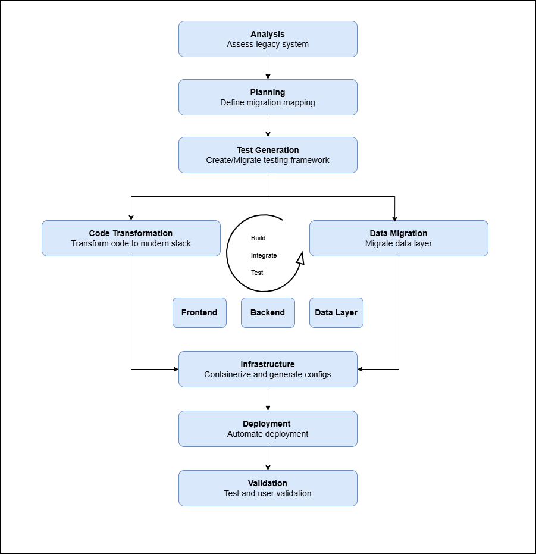

# Legacy Components to Modern Stack

| Legacy Component     | Modern Equivalent                      |
| -------------------- | -------------------------------------- |
| JSF + Managed Beans  | React (TypeScript) + REST API          |
| EJB (Business Logic) | Spring Boot Service classes            |
| JPA + Hibernate      | Spring Data MongoDB (NoSQL schema)     |
| JAX-RS Resources     | Spring REST Controllers                |
| Arquillian + JUnit   | JUnit + TestContainers + WebTestClient |
| H2 Database          | MongoDB Atlas                          |

# Migration  Diagram

This diagram illustrates the migration steps for transitioning from a Java EE stack to a modern containerized microservice architecture.

